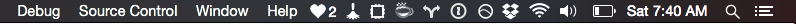

# streakerbar

A Mac OS X menubar app to track your open source contribution streak on GitHub.

### Dark theme



### Light theme


## Setup

Streakerbar app can read your `.gitconfig` assuming that it's in your home directory, `~/.gitconfig`, and configured thusly:

```
[github]
    user = chaserx
```

If you don't have this saved in your `.gitconfig`, it will ask you for your GitHub username.

## Contriubtors

- Michael Bates (@mklbtz)

## Contributing

Pull requests welcome! Please see our [contribution guide](CONTRIBUTING.md).
