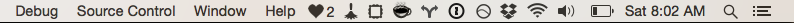

# streakerbar &hearts;

A Mac OS X menubar app to track your open source contribution streak on GitHub.


### Dark theme


### Light theme



## Installation via Homebrew Cask

1. `brew update`
1. `brew install caskroom/cask/brew-cask` (if you haven't done so already)
1. `brew cask install streakerbar`

## Setup

Streakerbar app can read your `.gitconfig` assuming that it's in your home directory, `~/.gitconfig`, and configured thusly:

```
[github]
    user = chaserx
```

If you don't have this saved in your `.gitconfig`, it will ask you for your GitHub username.

## Contributors

- Michael Bates (@mklbtz)
- Chase Southard (@chaserx)
- Nick Warner (@nikolaiwarner)

## Development

Targeting Swift 1.2 via Xcode 6.3

## Contributing

Pull requests welcome! Please see our [contribution guide](CONTRIBUTING.md).
